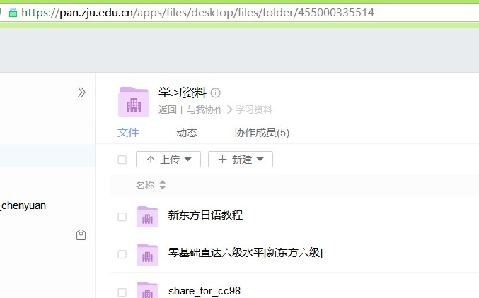
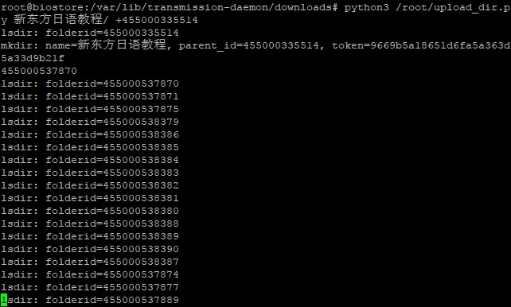

# 浙大云盘API

使用EasyLogin完成[浙大云盘](https://pan.zju.edu.cn)登录、上传、分享、下载直链获取

## 使用方法

### 第一步 解决依赖：安装python3，下载EasyLogin.py，安装requests和bs4

这个项目其实是EasyLogin的演示代码

```
# apt install python3-pip #安装python3和pip3
wget https://raw.githubusercontent.com/zjuchenyuan/EasyLogin/master/EasyLogin.py
pip3 install -U requests[socks] bs4 -i https://pypi.doubanio.com/simple/ --trusted-host pypi.doubanio.com
```

### 第二步 获取本项目源代码

由于这个github repo包含了太多其他项目，并没有必要git clone，此项目除去依赖的EasyLogin 其实只有两个py文件，只需wget下载即可

```
wget https://raw.githubusercontent.com/zjuchenyuan/EasyLogin/master/examples/panzju/panzju.py
wget https://raw.githubusercontent.com/zjuchenyuan/EasyLogin/master/examples/panzju/upload_dir.py
```

### 使用情景1——上传单个文件

```
python3 panzju.py 待上传的文件名 学号 浙江大学统一通行证密码
```


### 使用情景2——上传文件夹 upload_dir.py

Usage: `python3 upload_dir.py src dst`
src表示源文件夹路径，末尾的/会自动去除
dst表示上传的目标路径
如果目标文件夹路径(dst)以/结束，表示按源文件夹名称再创建一个子文件夹

指定目标文件夹如果已经存在 会跳过已经存在的同名文件

Example:
```
python3 upload_dir.py D:\Desktop\ebook /学习资料/电子书
    这样所有ebook文件夹下的内容将被上传到 电子书 文件夹下

python3 upload_dir.py /var/www/html/mywebsite /网站备份/
    这样会创建并上传至/网站备份/mywebsite，方便少打一次mywebsite

python3 upload_dir.py D:\Desktop\ebook +455000335510
    将ebook文件夹上传至目录id为455000335510的父文件夹下，这个一般用于直接对协作文件夹上传
```

举个例子：

我从pt站点下载好了 一个叫做 `新东方日语教程` 的文件夹，想上传到这个 `学习资料` 的协作文件夹



从地址栏看到`学习资料`这个文件夹的id是455000335514

那么上传命令就是:

```
python3 upload_dir.py 新东方日语教程 +455000335514
```

如图所示：


如果文件夹已经存在，会先调用lsdir列举目录 以 跳过已经存在的文件

## 给开发者看的

### 说明

panzju.py会自动保存、载入登录状态到panzju.status（使用EasyLogin提供的**save**与**load**函数）

所以在cookie没有失效时，不会发起登录请求，此时可以不提供用户名密码参数

#### panzju.py函数说明

```
login(xh, password) #使用统一通行证的用户名密码登录
islogin() #是否已经登录,如果已经登录返回token，否则False
upload(token, filename, data, filesize) #上传文件，返回fileid，data为文件二进制数据或者block函数产生的generator， 建议传入filesize
share(token, fileid) #分享文件，返回分享地址file_unique_name
download(file_uniqe_name) #从文件分享地址得到直接下载链接URL，本函数不要求登录，也不会使用登录状态
block(fp) #使用分块上传解决大文件传输的内存问题
# 还有一堆函数。。。TODO: fix this doc
```
